01 - 
select*from tb_alunos ta 
order by ta.nome asc 

02 -
select sigla, nome_curso
from tb_cursos tc 
where tc.carga_horaria = 1200

03 -
select nome, especialidade
from tb_docentes td 
where td.especialidade = "programação"

04 - 
select id_sala, numero_sala, capacidade
from tb_salas ts 
where ts.tipo = "teorica"

05 - 
select sigla_turma
from tb_turmas tt 
where turno = "tarde"

06 - 
select nome 
from tb_alunos ta 
where ta.id_aluno = 149

07 - 
select nome_sala, numero_sala
from tb_salas ts 
where ts.capacidade = 30

08 - 
select sigla
from tb_cursos tc 
where tc.carga_horaria = 1000

09 - 
select nome
from tb_alunos ta 
where nome like "w%"

10 - 
select nome, especialidade
from tb_docentes td 
where td.id_docente = 7

11 - 
select sigla_turma
from tb_turmas tt 
where tt.turno = "noite" and tt.id_curso_fk = 2

12 - 
select ta.nome 
from tb_alunos ta 
where ta.data_nascimento like "2005-03-12"

13 - 
select sigla_turma
from tb_turmas tt 
where tt.id_sala_fk = 6
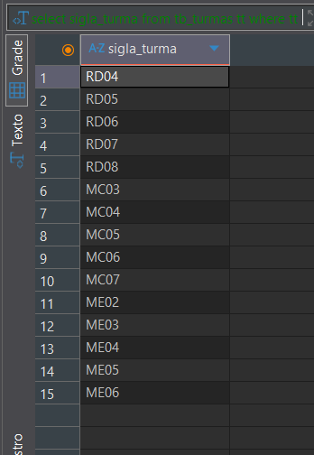

14 - 
select tc.id_curso, tc.nome_curso 
from tb_cursos tc 
where tc.carga_horaria > 800

15 - 
select td.nome 
from tb_docentes td 
where td.especialidade <> "enfermagem"
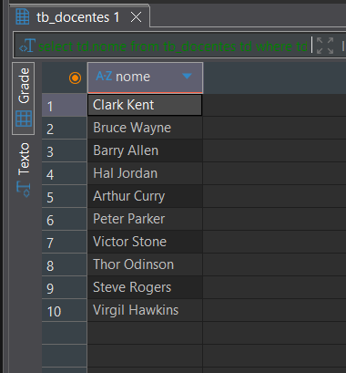

16 - 
select ta.id_aluno, ta.nome 
from tb_alunos ta inner join tb_aluno_turma tat 
on ta.id_aluno = tat.id_aluno_fk 
where tat.id_turma_fk = 17
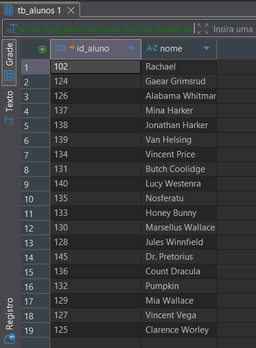

17 - 
select tc.nome_curso 
from tb_cursos tc 
where tc.id_curso = 10
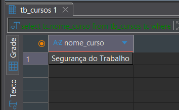

18 - 
select nome
from tb_docentes td inner join tb_docente_curso tdc 
where tdc.id_curso_fk = 19
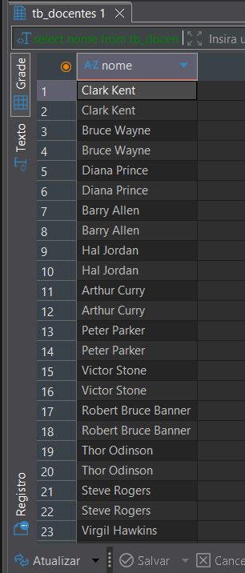

19 - 
select tt.sigla_turma , tt.turno 
from tb_turmas tt 
where tt.id_sala_fk  = 11
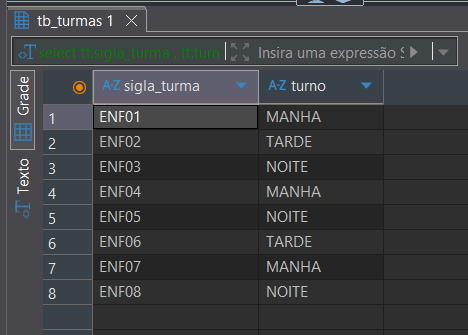

20 - 
SELECT tc.sigla, tc.nome_curso 
from tb_cursos tc inner join tb_turmas tm 
on tc.id_curso = tm.id_curso_fk 
where id_turma BETWEEN 56 and 60
 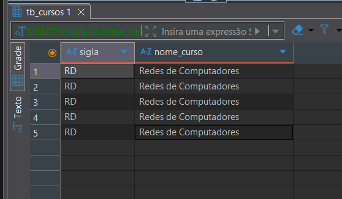

 21 - 
 select distinct nome_sala 
from tb_turmas 
inner join tb_salas on id_sala = id_sala_fk 
where turno = "manha"

22 - 
select td.id_docente, td.nome 
from tb_docentes td inner join tb_docente_curso tdc 
on td.id_docente = tdc.id_docente_fk 
where tdc.id_curso_fk = 5
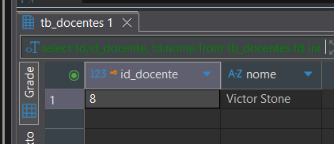

23 - 
select nome
from tb_alunos ta 
inner join tb_aluno_turma tat 
on ta.id_aluno = tat.id_aluno_fk 
inner join tb_turmas tt 
on tt.id_turma = tat.id_turma_fk 
where tt.sigla_turma = "sgt04"
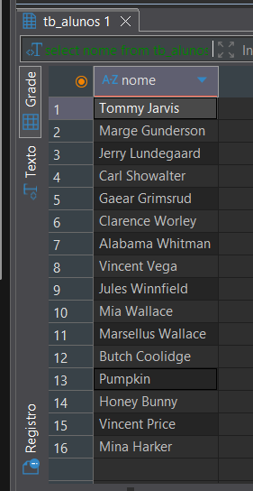

24 - 
select nome_curso
from tb_cursos tc 
inner join tb_turmas tt 
on tc.id_curso = tt.id_curso_fk 
inner join tb_salas ts 
on ts.id_sala = tt.id_sala_fk 
where ts.nome_sala = "laboratório de hardware"
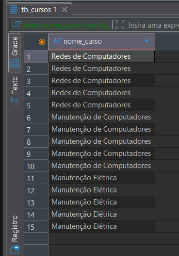

25 - 
select id_aluno_turma, id_aluno_fk
from tb_aluno_turma tat 
inner join tb_turmas tt 
on tat.id_turma_fk = tt.id_turma 
where tt.sigla_turma = "adm08"

26 - 
select nome, sigla_turma
from tb_alunos ta 
inner join tb_aluno_turma tat 
on ta.id_aluno = tat.id_aluno_fk 
inner join tb_turmas tt 
on tt.id_turma = tat.id_turma_fk 
where tt.sigla_turma = "ti25"
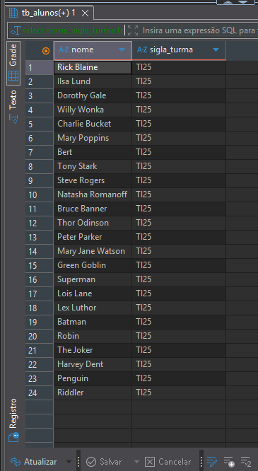

27 - 
select nome, nome_curso
from tb_docentes td 
inner join tb_docente_curso tdc 
on td.id_docente = tdc.id_docente_fk 
inner join tb_cursos tc 
on tc.id_curso = tdc.id_curso_fk 
where td.id_docente = 3

28 - 
select sigla_turma, nome_sala
from tb_cursos tc 
inner join tb_turmas tt 
on tc.id_curso = tt.id_curso_fk 
inner join tb_salas ts 
on ts.id_sala = tt.id_sala_fk 
where ts.capacidade = 40 and tc.nome_curso = "administração"
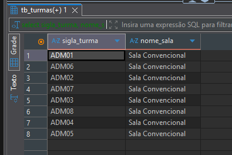

29 - 
select nome
from tb_alunos ta 
inner join tb_aluno_turma tat 
on ta.id_aluno = tat.id_aluno_fk 
inner join tb_turmas tt 
on tt.id_turma = tat.id_turma_fk 
where tt.sigla_turma = "ti26" or tt.sigla_turma = "ti30"
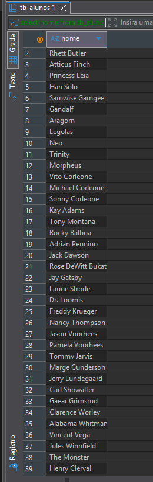

30 - 
select nome_sala
from tb_salas ts 
inner join tb_turmas tt 
on ts.id_sala = tt.id_sala_fk 
where ts.tipo = "laboratorio" and ts.capacidade <35
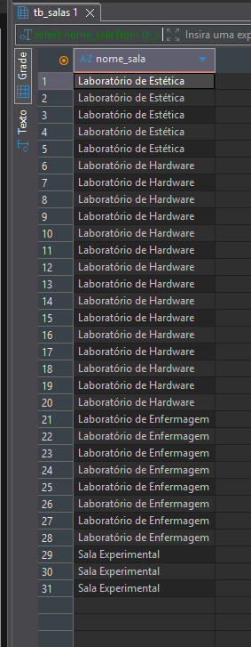

31 - 
select nome_curso 
from tb_cursos tc 
inner join tb_docente_curso tdc 
on tc.id_curso = tdc.id_curso_fk 
inner join tb_docentes td 
on td.id_docente = tdc.id_docente_fk 
where td.nome = "diana prince"
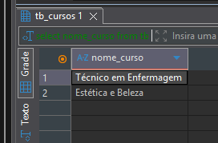

32 - 
select sigla_turma, nome_curso
from tb_turmas tt 
inner join tb_cursos tc 
on tt.id_curso_fk = tc.id_curso 
inner join tb_salas ts 
on ts.id_sala = tt.id_sala_fk 
where ts.nome_sala = "Laboratório de Enfermagem"
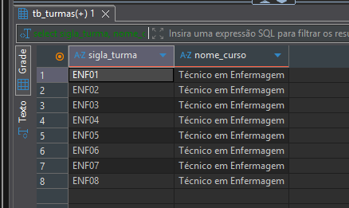

33 - 
select nome
from tb_alunos ta 
inner join tb_aluno_turma tat 
on ta.id_aluno = tat.id_aluno_fk 
inner join tb_turmas tt 
on tt.id_turma = tat.id_turma_fk 
where tt.sigla_turma = "ti29"
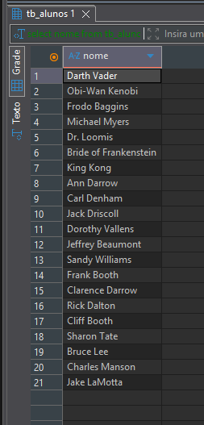

34 - 
select nome, sigla
from tb_docentes td 
inner join tb_docente_curso tdc 
on td.id_docente = tdc.id_docente_fk 
inner join tb_cursos tc 
on tc.id_curso = tdc.id_curso_fk 
where tdc.id_docente_fk = 5
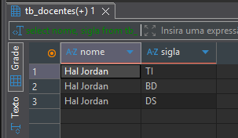

35 - 
select sigla_turma, nome_curso
from tb_turmas tt 
inner join tb_cursos tc 
on tt.id_curso_fk = tc.id_curso 
where tc.sigla = "ti" or tc.sigla = "tii"
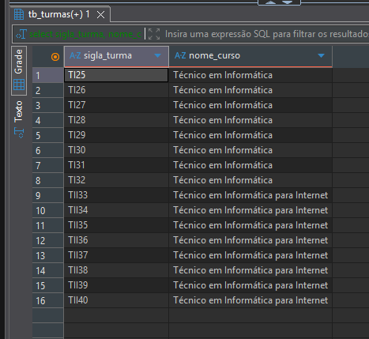

36 - 
select nome_curso
from tb_cursos tc 
where not tc.id_curso = 1
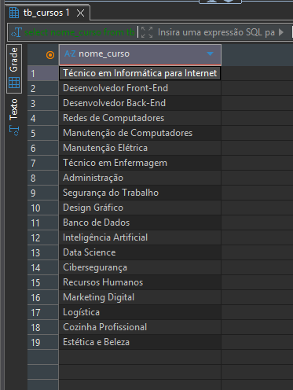

37 - 
select nome_sala, sigla_turma
from tb_turmas tt 
inner join tb_salas ts 
on ts.id_sala = tt.id_sala_fk 
where tt.turno = 'noite' and ts.tipo = 'teorica'
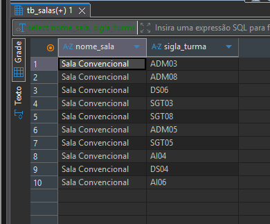

38 - 
select nome, id_turma_fk
from tb_aluno_turma tat 
inner join tb_alunos ta 
on ta.id_aluno = tat.id_aluno_fk 
where tat.id_aluno_fk = 40
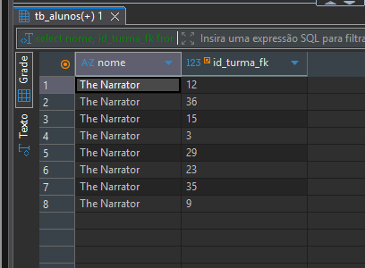

39 - 
select sigla_turma, nome_curso
from tb_turmas tt 
inner join tb_cursos tc 
on tc.id_curso = tt.id_curso_fk 
where tc.carga_horaria = 800
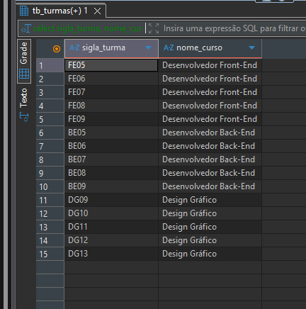

40 - 
select nome, especialidade
from tb_docentes td 
where td.id_docente = 11
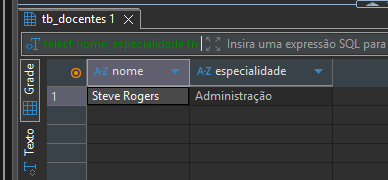

41 - 
select sigla_turma, nome_curso
from tb_turmas tt 
inner join tb_cursos tc 
on tc.id_curso = tt.id_curso_fk 
where tt.turno = 'manha'
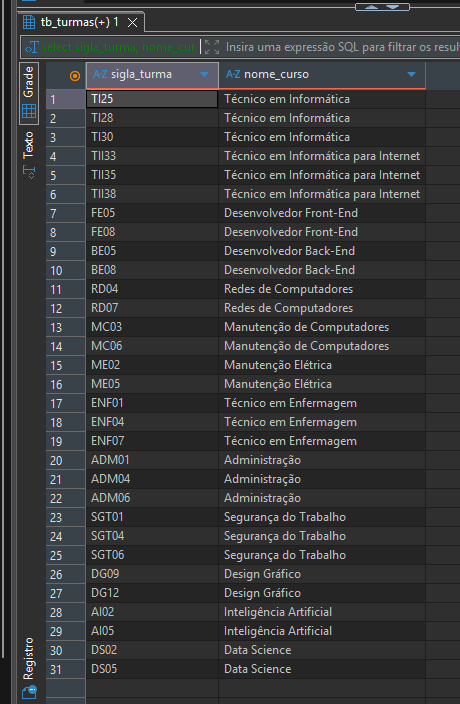

42 - 
select nome_sala, numero_sala
from tb_salas ts 
where ts.capacidade <> 40
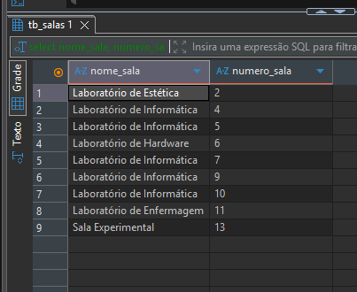

43 - 
select nome, id_aluno
from tb_alunos ta 
inner join tb_aluno_turma tat 
on ta.id_aluno = tat.id_aluno_fk 
inner join tb_turmas tt 
on tt.id_turma = tat.id_turma_fk
where tt.id_sala_fk = 7
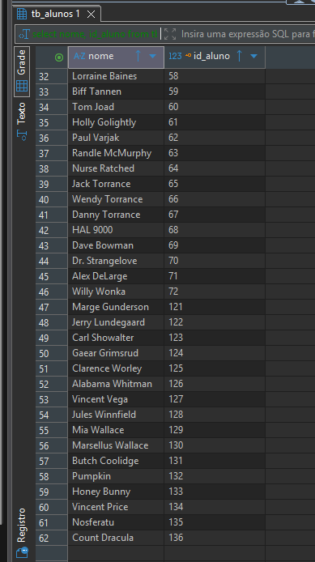

44 - 
select nome_curso, carga_horaria
from tb_cursos tc 
where tc.carga_horaria > 1000
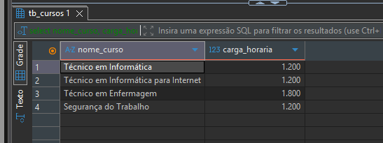

45 - 
select sigla_turma, turno
from tb_turmas tt 
where tt.id_curso_fk = 8 and tt.id_sala_fk = 11
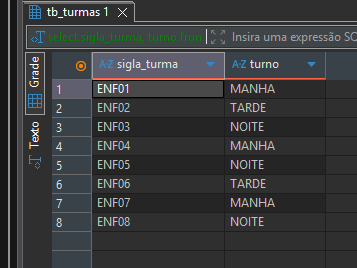

46 - 
select nome
from tb_docentes td 
where td.especialidade = 'Administração'
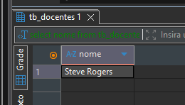

47 - 
select id_aluno, nome, data_nascimento
from tb_alunos ta 
where ta.id_aluno > 230
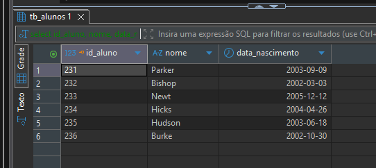