01 - 
select*from tb_alunos ta 
order by ta.nome asc 
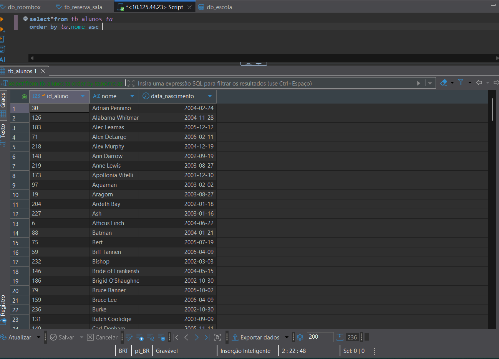

02 -
select sigla, nome_curso
from tb_cursos tc 
where tc.carga_horaria = 1200
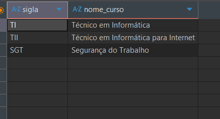

03 -
select nome, especialidade
from tb_docentes td 
where td.especialidade = "programação"
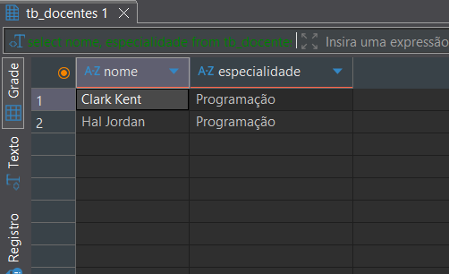

04 - 
select id_sala, numero_sala, capacidade
from tb_salas ts 
where ts.tipo = "teorica"
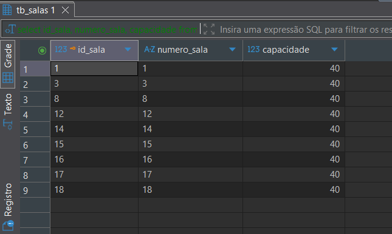

05 - 
select sigla_turma
from tb_turmas tt 
where turno = "tarde"
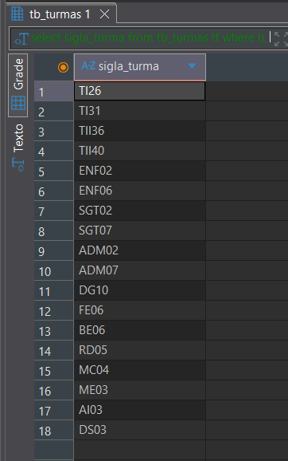

06 - 
select nome 
from tb_alunos ta 
where ta.id_aluno = 149
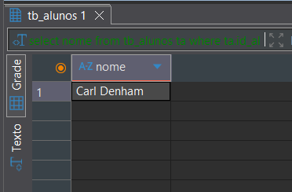

07 - 
select nome_sala, numero_sala
from tb_salas ts 
where ts.capacidade = 30
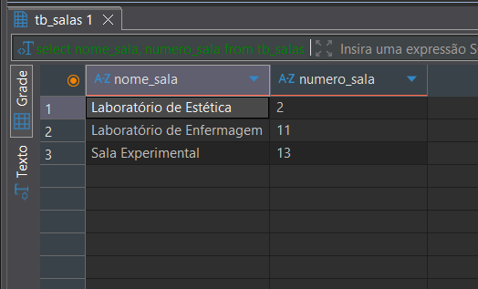

08 - 
select sigla
from tb_cursos tc 
where tc.carga_horaria = 1000
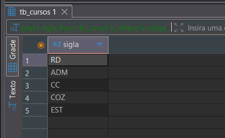

09 - 
select nome
from tb_alunos ta 
where nome like "w%"
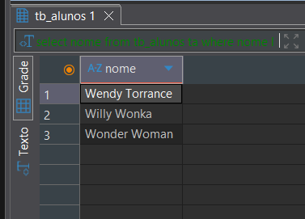

10 - 
select nome, especialidade
from tb_docentes td 
where td.id_docente = 7
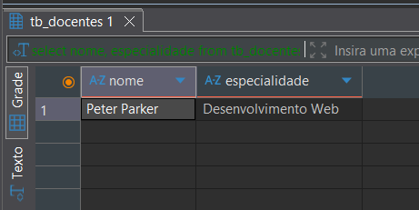

11 - 
select sigla_turma
from tb_turmas tt 
where tt.turno = "noite" and tt.id_curso_fk = 2
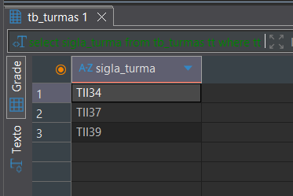

12 - 
select ta.nome 
from tb_alunos ta 
where ta.data_nascimento like "2005-03-12"
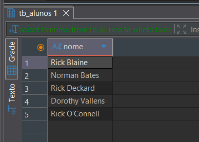

13 - 
